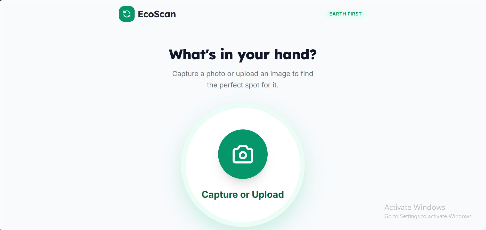
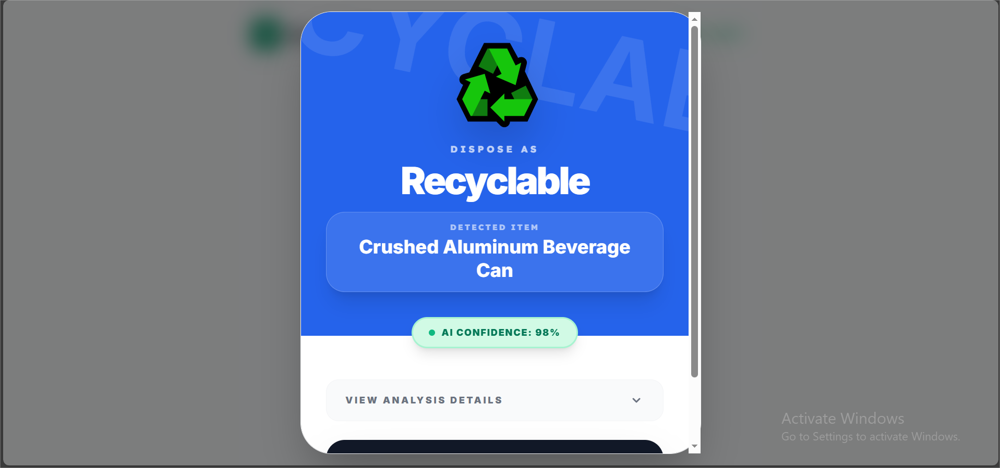
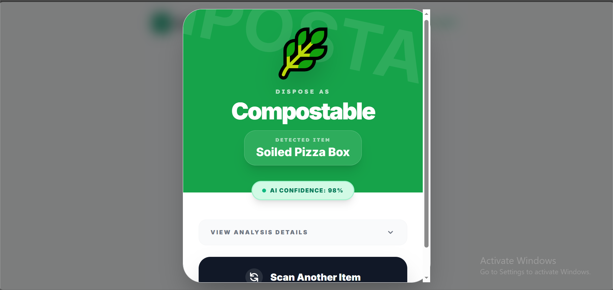
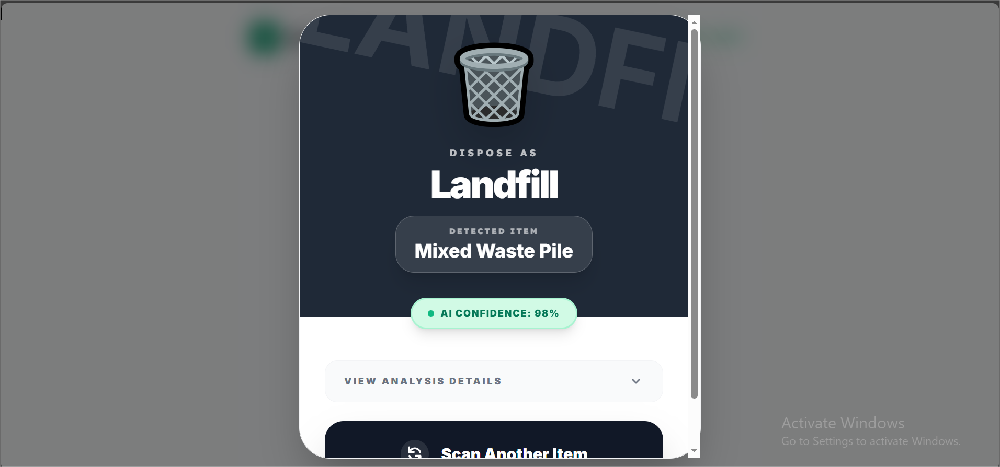
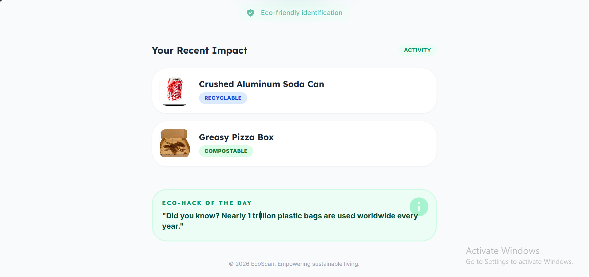

# EcoScan ♻️

**AI-Powered Waste Classification Web App**

`React` `TypeScript` `Vite` `Gemini`

A mobile-first AI web app that classifies household waste into recycle, compost, or landfill using Google Gemini 3 Flash vision. Built for a hackathon with a focus on real-world usability at the point of disposal.

## Why This Project

Most people don't know whether an item is recyclable, compostable, or trash — leading to contaminated recycling streams and avoidable landfill waste. EcoScan removes the guesswork: snap a photo, get an instant, explained classification, right at the moment of disposal.

## Screenshots

| Capture | Recyclable | Compostable | Landfill |
|---|---|---|---|
|  |  |  |  |




## ✨ Features

- 📸 Upload any waste item image — get instant AI classification
- 🧠 Gemini 3 Flash prompt engineered to detect contamination (e.g. grease on cardboard)
- 📊 Honest confidence score — says "unclear" instead of guessing on bad images
- 🎨 Color-coded results:
  - 🟢 Green = Compostable
  - 🔵 Blue = Recyclable
  - ⚫ Black = Landfill
- 📝 Material-level explanation of classification reasoning
- 📈 Recent impact history
- 💡 Daily Eco-Hacks feature
- ⚡ Progressive UI for near-instant processing

## 🛠️ Tech Stack

| Technology | Usage |
|---|---|
| React + TypeScript | Frontend framework |
| Vite | Build tool |
| Gemini 3 Flash | AI vision & classification |
| Google AI SDK | Gemini API integration |

## 🚀 How to Run

**Prerequisite:** Node.js 18+

```bash
# Install dependencies
npm install

# Set your Gemini API key in .env.local
GEMINI_API_KEY=your_api_key_here

# Start the app
npm run dev
```

## 🧠 Prompt Engineering Highlights

- Detects contamination, not just object type (e.g. greasy cardboard → compost, not recycle)
- Returns honest confidence scores — flags unclear images instead of guessing
- Material-level reasoning explanation for each classification

## 👤 Author

Built by **Areeba Ghaffar**
GitHub: [@AreebaGhaffar](https://github.com/AreebaGhaffar)
